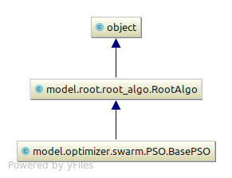

## Temp
1. Accuracy
```code
    ELM, GA-ELM, PSO-ELM, WOA-ELM, MLNN, RNN, LSTM, GRU - done
```
    
2. Stability
```code
    ELM, GA-ELM, PSO-ELM, WOA-ELM,  MLNN, RNN, LSTM, GRU  - done
```


# Links:
```code 
1. git: https://github.com/thieunguyen5991/woa_elm
2. paper: https://bitbucket.org/nguyenthieu2102/paper_whale/
```

# Model comparison
1. ELM
2. RNN
3. LSTM
4. GA-ELM
5. PSO-ELM
6. WOA-ELM

## ELM characteristics
```code 
1. ELM là thuật toán không phải mô hình mạng, áp dụng cho mạng single-hidden-layer feed-forward neural network 
2. Input weights và Hidden Biases được random ngẫu nhiên, còn Output weights và output bias được tính dựa vào 
phép nhân ma trận nghịch đảo.
3. ELM chạy rất nhanh, kết quả tốt, có khả năng tổng quát tốt 
4. ELM có nhược điểm là phụ thuộc vào việc random, yêu cầu cần nhiều hidden unit trong tầng ẩn để tổng quát tốt.
5. Tuy nhiên yếu tố random trong ELM là không nhiều, do vậy thường khi chạy ELM cho ra cùng 1 kết quả, tính stable rất cao. 
```

## ELM improvements
```code 
1. Sử dụng các giải thuật để tối ưu Input weights và Hidden biases 
2. Do đặc tính chạy nhanh của ELM nên trong paper không so sánh được về mặt time (vì các model khác đều chậm hơn ELM)
3. Do đặc tính stable của ELM nên khi so sánh tính stability nên loại bỏ ELM vì biết chắc nó có tính stable đến 99% 
```


# Project structure
1. General view class


2. Details view class
* root files

  

* algorithm files

  

 

* main files


## Server Errors: Check lỗi multi-threading giữa numpy và openBlas
Ta phải check xem core-backend của numpy nó đang dùng thư viện hỗ trợ nào : blas hay mkl
    python
    import numpy
    numpy.__config__.show()
    
https://stackoverflow.com/questions/17053671/python-how-do-you-stop-numpy-from-multithreading
https://stackoverflow.com/questions/19257070/unintented-multithreading-in-python-scikit-learn

---> Để chặn numpy không chạy multi-thread sẽ tốn thời gian trao đổi:
Thêm vào file ~/.bashrc hoặc ~/.bash_profile dòng sau:
    export OPENBLAS_NUM_THREADS=1   (Nếu dùng OpenBlas)
    export MKL_NUM_THREADS=1        (Nếu dùng MKL)

    export OPENBLAS_NUM_THREADS=1  
    export MKL_NUM_THREADS=1       

## Neu bi loi: Cannot share object lien quan den matplotlib tren server thi sua nhu sau:
```
    sudo apt update
    sudo apt install libgl1-mesa-glx
```
